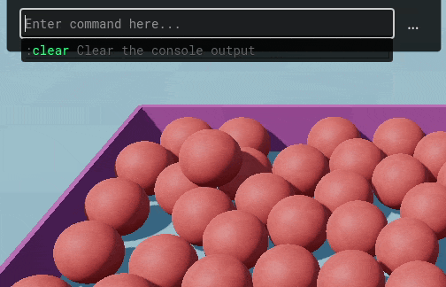
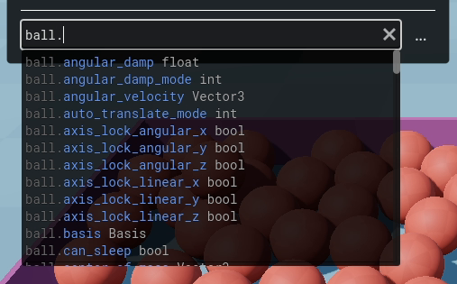
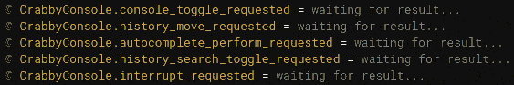
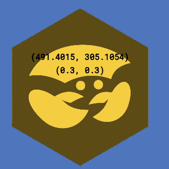
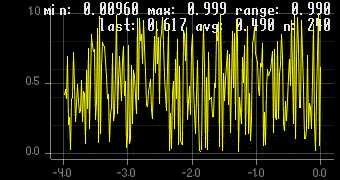

# CrabbyConsole


[](https://ko-fi.com/W7W2X7WN)


CrabbyConsole is a feature-packed dev console for your Godot game, allowing you to run arbitrary GDScript and custom commands during the game. It can be used for debugging, inspecting and modifying your game at runtime, and also for diagnosing performance problems.

Features:

- Custom command system built on the Rust [`clap`](https://crates.io/crates/clap) crate
- Watch variables, expressions and signals
- Performance metrics (frame rate, memory usage, VRAM usage, disk usage, etc)
- Debug drawing, ranging from lines to rectangles, cubes, spheres and text (2D and 3D)
- Plotting system, to generate line plots and histograms of any expression
- History search system
- Advanced autocomplete for GDScript and custom commands
- Async-compatible (supports awaiting signals)
- Remote console, for running commands remotely (potentially from another device)
- High performance (since it's written in Rust)
- Log hook support
- VR support (experimental)
- Fully open source
- Lightweight: small in filesize, uses little CPU and RAM 
- AI-free documentation: no LLM output is used in the documentation, it is 100% written by hand

[The documentation is available here](https://bauxitedev.github.io/crabbyconsole/). 

A small demo:




## Installation

How to add CrabbyConsole to your game:

1. [Download CrabbyConsole from the Releases section on GitHub](https://github.com/Bauxitedev/crabbyconsole/releases) (or Asset Store, coming soon).
1. Copy the `addons` folder from the zip file to your Godot game. 
2. In Godot, go to your project settings and enable the `CrabbyConsole` plugin. 
4. The console is now active. Start your game and press ~ (tilde) to open the console:
    
5. Type `:help` to see which commands you can run. Any command not starting with `:` is treated as GDScript, so you can run pretty much anything you could write in your game's GDScript code.

The console should just work at this point, no further setup needed - if it doesn't, make sure you're on at least Godot 4.6 and you're using a supported platform (see below for supported platforms). If it still doesn't work, that's a bug, please open an issue.

> [!CAUTION]
> CrabbyConsole is alpha software, expect things to change and break.


## Example commands

Try running some of these to get started:

### Set window size
```
:win size 1280 800
```

### Enable fullscreen
```
:win mode fullscreen
```

### Show detailed information about the system
```
:sysinfo --pretty
```

This prints the CPU model, amount of cores/threads, GPU name, GPU driver version, total RAM amount, Godot version, etc. This is useful for tech support, since it can be copy-pasted and sent to developers for troubleshooting.

### See how much memory your game is using (in megabytes)
```
:perf mem 
```

### Reload the current scene
```
:reload
```

### Restart the game
```
:restart
```

### Bind a key to an action
```
:key bind f12 :screenshot 
```
Now you can press F12 to take a screenshot of your game. The screenshot will be saved in `user://screenshots/`, you can open that folder automatically by running:

```
:open screenshots
```

----

Another possibility:

```
:key bind f5 :reload
```
Now you can press F5 to reload the main scene.

### More commands

There are many more possible commands, run `:help` to explore all of them:
```
:help
```

Alternatively, [read the documentation to see a comprehensive list of all commands](https://bauxitedev.github.io/crabbyconsole/crabbyconsole/20_commands/03_commands/).

## Custom commands

Adding custom commands can be done with a single line of GDScript. All you need to do is run this somewhere in your game:
```gdscript
CrabbyConsole.add_custom_command("foo", func(): print("hi"))
```
...then run `:foo` and it will print `"hi"` to the console.

For more information, refer to section [Custom commands in the documentation](https://bauxitedev.github.io/crabbyconsole/crabbyconsole/20_commands/10_custom_commands/).

## Autocomplete

CrabbyConsole has an advanced autocomplete engine for GDScript and custom commands.

For example, if you assign a variable named `ball` and then type `ball.` it will autocomplete to:



For more information, see section [Autocomplete in the documentation](https://bauxitedev.github.io/crabbyconsole/crabbyconsole/40_misc/01_autocompletion/).

## Watching expressions

You can watch any GDScript expression in real time, configure how often it gets evaluated, and you can also watch signals being emitted in real time on any node:



To set this up, see section [Watching expressions in the documentation](https://bauxitedev.github.io/crabbyconsole/crabbyconsole/20_commands/04_watches/).

## Debug drawing

You can draw all kinds of shapes in 2D and 3D, including lines, rectangles, circles, spheres, text, etc.

Here's an example of drawing a `Sprite2D`'s position and scale:



To set this up, see section [Debug drawing in the documentation](https://bauxitedev.github.io/crabbyconsole/crabbyconsole/20_commands/15_debug_draw/).

## Plotting expressions

CrabbyConsole allows you to make plots out of any GDScript expression.

For example, here is a plot of `randf()`:



You can use this to plot the frame times of your game, memory usage, VRAM usage, disk usage, etc. Any GDScript expression you can think of works!

To set this up, see section [Plotting expressions in the documentation](https://bauxitedev.github.io/crabbyconsole/crabbyconsole/20_commands/21_plotting/).

## Platform support

### Supported platforms

| Platform  | Supported |
| ------------- | ------------- |
| Windows  | ✅ |
| Linux | ✅ |
| MacOS |  ❌ |
| Web | ❌|
| Android | ❌ |
| iOS | ❌ |

More platforms may be supported in the future.

### Supported Godot versions

| Godot version  | Supported  |
| ------- | ----------------- |
| ≤4.4.x  | ❌  |
| 4.5.x   | ❌  |
| 4.6.x   |  ✅  |
| 4.7.x   |  ✅ |
| 4.8.x   |  ✅  |


## Development

To compile CrabbyConsole yourself, see section [Development in the docs](https://bauxitedev.github.io/crabbyconsole/crabbyconsole/40_misc/45_development/).

## Attribution

CrabbyConsole owes its existence to the contributors who have worked hard on the Godot engine and [godot-rust](https://github.com/godot-rust/gdext); without their hard work, this project could not exist.

For further attribution, see [Attribution page in the documentation](https://bauxitedev.github.io/crabbyconsole/crabbyconsole/40_misc/50_attribution/).

## License

CrabbyConsole is licensed under either [MIT](https://opensource.org/license/mit) or [Apache 2.0](https://www.apache.org/licenses/LICENSE-2.0), whichever you prefer.

