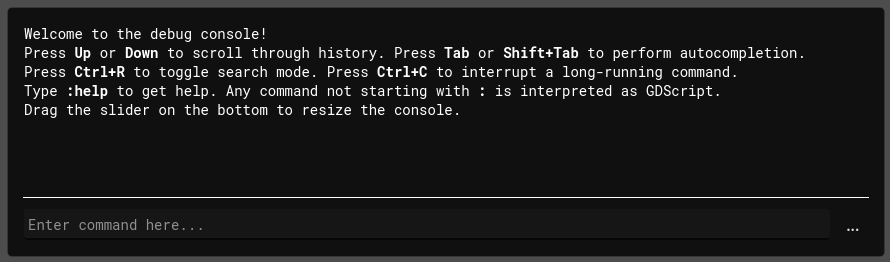

# Installation

How to add CrabbyConsole to your game:

1. [Download CrabbyConsole from the Releases section on GitHub](https://github.com/Bauxitedev/crabbyconsole/releases) (or the Asset Store, coming soon).
1. Copy the `addons` folder from the zip file to your Godot game. 
2. In Godot, go to your project settings and enable the `CrabbyConsole` plugin[^2]. 
4. The console is now active. Start your game and press ++tilde++ (tilde) to open the console[^1]:
    
5. Type `:help` to see which commands you can run. Any command not starting with `:` is treated as GDScript, so you can run pretty much anything you could write in your game's GDScript code.

The console should just work at this point, no further setup needed - if it doesn't, [make sure you're on at least Godot 4.6 and you're using a supported platform.](../40_misc/40_platform_support.md) If it still doesn't work, that's a bug, please open an issue.

[^2]: This will automatically add the `CrabbyConsole` autoload to your game. If you disable the plugin, the autoload will be removed again.
[^1]: If you don't like pressing ++tilde++ to open it, you can rebind it to another key by adding an input map to your game called `crabbyconsole_toggle`.

!!! warning
    CrabbyConsole is alpha software, expect things to change and break.

!!! tip "Protip"
    CrabbyConsole comes with a library file for every OS (`.dll` for Windows, `.so` for Linux, etc), even the ones you're not currently using. This may seem like a waste of disk space at first, but this has a good reason. If the other platforms weren't included, you wouldn't be able to cross-export your game to another OS. For example, let's say you're on a Windows machine. If the `.so` file wasn't included, you wouldn't be able to export your game to Linux at all.