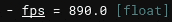
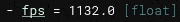
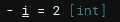
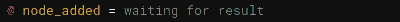
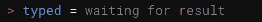
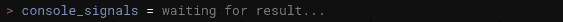
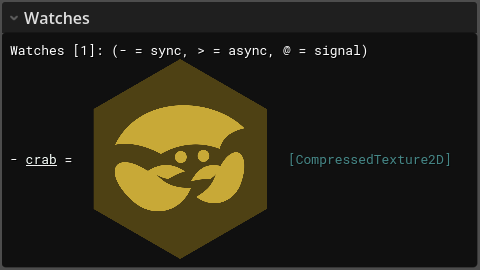
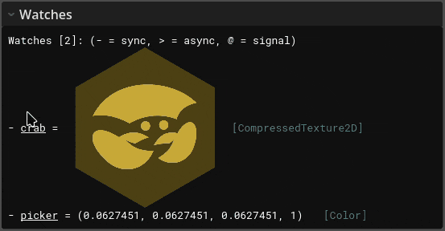

# Watching expressions

You can add a "watch" to observe the value of any expression in real time.

## Adding a watch

To add a watch, run:
```
:watch add fps :perf fps
```
This will add a watch called `fps` that evaluates the expression `:perf fps` every frame, which returns the current framerate. Now you can see the game's framerate in the top right:

{: style="opacity:0.8" }

## Watch rate limiting

The expression `:perf fps` will be evaluated every frame (even when the console is hidden), which can cause performance issues. To make the expression evaluate less often, you can use the `--rate` parameter, e.g.
```
:watch add --rate 1 fps :perf fps
```
Now the watch will be updated only once per second:

{: style="opacity:0.8" }

Notice how the line under the watch flashes every second, to indicate when it is updated.

## Watch with side effects

Watches can have side effects, which can be useful to make something happen on a regular interval. For example, try running this:

```
:set i 0
:watch add --rate 1 i :set i i+1
```

Now the variable `i` will be incremented every second:

{: style="opacity:0.8" }

Or you can run this:

```
:watch add --rate 0.5 beeper :beep
```

Now you will hear a beep sound every two seconds.

!!! tip "Protip"
    Most Clap commands have arguments that can be shortened, as long as they don't conflict with other argument names. For example, you can also use `-r` instead of `--rate`:

    ```
    :watch add -r 0.5 beeper :beep
    ```


## Watching signals
The watch can also respond to signals being emitted by any node in the game. 
To do this, you can add a watch that resolves to a signal, like this:

```
:watch add node_added tree().node_added
```

This watch resolves to the `node_added` signal on `SceneTree`. Now the watch will update every time you add a node to the tree. 

Try running this in the console now:
```gdscript title="GDScript"
var foo = Node.new(); root().add_child(foo); foo.name = "foo"
```

Now observe the watch reacting to your newly added node:

{: style="opacity:0.8" }

Remember, this can be used for **any signal on any node**, so this is very useful for debugging signal-related problems in your game.

----

There are also some built in commands that can be useful to watch. For example, to watch key presses, you can do:

```
:watch add typed :key await
```

Now the watch will update every time you press a key:

{: style="opacity:0.8" }


!!! info "Note"
    This only works for unhandled key presses, so it won't trigger if you type anything in the console's text box, since the text box is already handling those events.

### Watching all signals

To watch all signals on a node, you can do:

```
:watch signals :node find /root/CrabbyConsole
```

This adds a watch for every signal on the given node, in this case the console itself. Now we can see all signals being emitted by the console in real time:

{: style="opacity:0.8" }

This does introduce some visual clutter though, since we don't care about many of the signals. To combine all signal watches into one watch, you can instead do this:

```
:watch add console_signals :node signals /root/CrabbyConsole
```

Now there will be only one watch that will be updated if *any* signal on the node is emitted:

{: style="opacity:0.8" }

## Removing watches

To remove a watch you can use `:watch rm <NAME>`, where `<NAME>` is the name of the watch, or `:watch clear` to remove all of them.

## Special watches

### Watching images

If you watch an expression that returns a `Texture2D` (or one of its derived classes), the watch will draw the texture for you.

Try it:
```
:watch add crab CrabbyConsole.logo
```

Now you'll see a crab in the top right:

{: style="opacity:0.9" }

This can be very useful to visualize textures that change over time; see section [Plotting expressions](../20_commands/21_plotting.md) for a practical example of changing textures.

### Watching colors

If you watch an expression that returns a `Color`, a little square will appear next to it that shows the actual color.

Now you make your own color picker:
```
:watch add picker viewport().get_texture().get_image().get_pixelv(cursor_2d())
```

Try moving your mouse around to see it in action:

{: style="opacity:0.9" }
