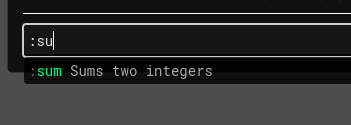

# Adding custom commands
## Clap commands

To add your own Clap commands, you can run this GDScript code in your game somewhere:

```gdscript title="GDScript"
CrabbyConsole.add_custom_command("foo", func(): print("hi"))
```

Now run this in the console:
```
:foo
```
...and it will print `hi`.

You can also add arguments like this:

```gdscript title="GDScript"
CrabbyConsole.add_custom_command("sum", func(a, b): return a + b)
```

Now if you run this...
```
:sum 1 2
```
...you will see:
```
12
```
Huh? :face_with_raised_eyebrow: Isn't 1 + 2 = 3? Well, the console actually interprets all arguments as strings, so `+` is actually doing string concatenation instead of summing. This is intentional, so you get full control over how the arguments are parsed.

To fix it, parse the strings as numbers:

```gdscript title="GDScript"
CrabbyConsole.add_custom_command("sum", func(a, b): return int(a) + int(b))
```

Now `:sum 1 2` gives the expected result `3`.

You can alternatively add commands using
`:cmd add foo :beep`. This is useful to reduce repetition for building long command chains in the console. However, it is more limited, since arguments are not supported, so use `#!gdscript add_custom_command()` instead if you need them.

### Parsing arguments

Arguments are split by spaces, so if you need arguments with spaces in them, you must merge them back together using `#!gdscript " ".join(args)`. Here's an example using a variadic lambda, so it works for any amount of arguments:

```gdscript title="GDScript"
CrabbyConsole.add_custom_command("double-all", func(...args): return JSON.parse_string(" ".join(args)).map(func(i): return i * 2))
```

Now you can use this command to double any array of numbers, even if it contains spaces:
```
:double-all [1, 2, 3]
```
Output:
```
[2.0, 4.0, 6.0]
```

!!! question "What's a variadic lambda?"

    A *variadic* function can take any amount of arguments. For instance, the `print()` function is variadic, because you can feed as many arguments into it as you want:

    ```gdscript
    print(1, 2, 3, 4, 5)
    ```

    Since Godot 4.5+, you can define one yourself using the `...args` syntax:

    ```gdscript linenums="1"
    func myprint(...args):
      print(args)
    ```

    Now `args` will contain the list of all arguments. 

    A variadic lambda is just a way to define a variadic function without a name:

    ```gdscript linenums="1"
    var myprint = func(...args): print(args)
    myprint.call(1, 2, 3, 4, 5)
    ```
    
    
    Consult the [official docs](https://docs.godotengine.org/en/stable/tutorials/scripting/gdscript/gdscript_basics.html#variadic-functions) for more information.

Here's maybe a more practical example. This is a command that returns all nodes in the given group, even if the group name has a space:

```gdscript title="GDScript"
CrabbyConsole.add_custom_command("find-nodes-in-group", func(...args): return Engine.get_main_loop().get_nodes_in_group(" ".join(args)))
```

Now you can do...
````
:find-nodes-in-group my amazing group
````
...and it returns an array of all nodes in the `my amazing group` group.

!!! danger "Beware!"
    
    Make sure you parse your arguments safely. [Never use `str_to_var()`, since it allows arbitrary code execution](https://github.com/godotengine/godot/issues/80562). Instead, use `JSON.parse_string()`. This works even if the value doesn't look like valid JSON at first, e.g. `JSON.parse_string('"hi"')` and `JSON.parse_string("5")` all work fine.

### Removing commands

You can remove the custom command by running `:cmd remove foo`.

### Adding custom help

Custom commands are [first-class citizens](https://en.wikipedia.org/wiki/First-class_citizen) - that means, they behave the same as built-in commands. They will show up in `:help` and `--help`. To customize the help string, you can pass a third argument to `add_custom_command()`:

```gdscript title="GDScript"
CrabbyConsole.add_custom_command("sum", func(a, b): return int(a) + int(b), "Sums two integers")
```

Now try running `:help sum` or `:sum --help` to see your help string:
```
> :sum --help
Sums two integers

Usage: sum [ARGS]...

Arguments:
  [ARGS]...  

Options:
  -h, --help  Print help
```

The help string will also show up in autocomplete (see section [Autocompletion](../40_misc/01_autocompletion.md)), try typing `:su` to see it:



## GDScript commands

To add your own GDScript commands, create a GDScript file in your project called `MySingleton.gd`:

```gdscript title="MySingleton.gd"
extends Node

func my_method():
  print("my method called")
```

Then, go to Project Settings :lucide-move-right: Globals, select `MySingleton.gd`, name it `MySingleton` and then click <span class="pill">+ Add</span>.

Now start up the game and run this in the console:
```
MySingleton.my_method()
```

Now it prints `my method called`.

!!! info "Protip"
    If you already have a singleton in your game, good news! You don't have to do any of this, it will work automagically.

!!! info "Protip 2"
    The method you define can also be async; in that case, don't forget to call it using the `await` keyword:
    ```gdscript
    await MySingleton.my_async_method()
    ```

    The method will run to completion in the background, so it cannot be interrupted - this behavior may be changed later. For more information, see section [Async commands](../30_advanced_commands/15_async.md).