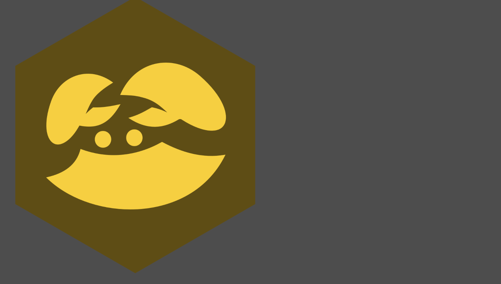
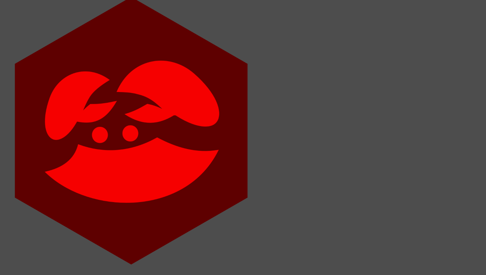
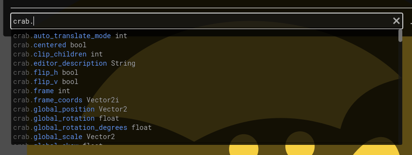
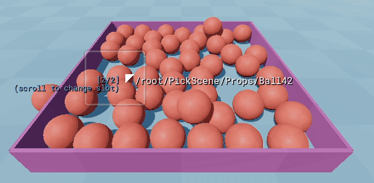

# Working with nodes


CrabbyConsole allows you to create, inspect, modify and delete any node in your scene tree at runtime.

## Spawning nodes

Let's start with a simple example. Try running this:

```gdscript
var node = Sprite2D.new(); node.name = "CrabSprite"; node.position = v2(500, 500); node.texture = CrabbyConsole.logo; add_child(node)
```

???+ question "What does this do?"
    Putting the commands on a single line can be confusing, so here's the multi-line version:

    ```gdscript 
    var node = Sprite2D.new()
    node.name = "CrabSprite"
    node.position = v2(500, 500)
    node.texture = CrabbyConsole.logo
    add_child(node)
    ```

    So, it creates a `Sprite2D`, names it `CrabSprite`, assigns a position and texture to it, and finally adds it to your scene.

Now a crab should appear in your game:


## Finding nodes

Now, let's find the node we just spawned, so we can do more things with it.

Try running this:
```
:node find CrabSprite
```

This will scan the node tree of your game to find the first node called `CrabSprite`, and it will return a reference to it:
```
CrabSprite:<Sprite2D#134570051335> 
```

!!! tip "Protip"
    The command `:node find` will find nodes using the node's `NodePath`, so you could also do something like this:

    ```
    :node find /Foo/CrabSprite
    ```
    Now it will only find nodes named `CrabSprite` that have a parent called `Foo`. (It won't return any results in this case, because its parent is not called `Foo`, but I digress.)

    You can also use `--all` or `-a` to find *all* nodes with the given name, instead of just the first one:
    ```
    :node find --all CrabSprite
    ```

    This will return an array of node references.

To store the reference in a variable, run this:

```
:set crab :node find CrabSprite
```

Now `crab` refers to our freshly created crab.

Now we can mess with him:
```
crab.rotation_degrees = 180
```

This rotates the crab by 180 degrees. In other words, now he's upside down!



!!! tip "Protip"

    You can also use radians, if you prefer:
    ```
    crab.rotation = PI
    ```

Now try this:
```
crab.modulate = Color.RED
```

Now he's angry![^1] 



Remember, **you can adjust any property and call any method on any node in your game**. So this is very powerful!

!!! tip "Protip"
    To see a list of all properties and methods you can call on the crab, try typing `crab.` without pressing ++enter++:

    

    You can press ++tab++ and ++shift+tab++ to move back and forth through the suggestion list.


## Deleting nodes

If you have a reference to a node, you can delete it by simply doing this:
```gdscript
crab.queue_free()
```
Now the crab is gone. Goodbye, crab. :saluting_face:

For you own safety, you should probably unset the variable referencing it as well:
```
:set crab null
```

Otherwise, you may get confusing errors if you try to access `crab` later.

### Deleting multiple nodes

You can use `:node find --all` to find all nodes matching a specific predicate.

For example, to get all `Sprite2D` derived nodes in your scene, and store them in a variable named `all_sprites`, you can do this:
```
:set all_sprites :node find --all --type Sprite2D
```

Then, you can delete them all by doing this:
```gdscript
for sprite in all_sprites: sprite.queue_free()
```

## Reloading nodes

You can use the `:node reload` command to reload nodes from disk.

Example:
```
:node reload CrabbyConsole
```

In this case, it reloads the console itself, so it will go back to its initial state. Useful if you messed something up.

!!! warning "Beware!"
    This may cause crashes if you try to access `CrabbyConsole` from GDScript afterwards. Godot generally doesn't like it if you mess with autoloads at runtime, see [this warning in the official docs](https://docs.godotengine.org/en/stable/tutorials/scripting/singletons_autoload.html#autoload) (scroll down to see it).

!!! note "Note"

    This will only work for nodes that were loaded from disk to begin with. For example, if you spawn a `Node3D` by doing `add_child(Node3D.new())`, and then try to reload it, it won't work. Because the node was created from scratch, not loaded from a `.tscn` file.

## Node picker

Sometimes, you want to apply an operation to a specific node in a scene, but it's hard to find the specific node you're looking for. It could be that there are many nodes in the scene that have a similar name or type, making it hard to find them using `:node find`. To fix that, you can use the node picker.

To get started, open the CrabbyConsole demo project in Godot, run it, and click <span class="pill">...</span> next to the text input of the console to open the node picker. Then, select the kind of node you want to pick: either `Control`, `Node2D`, or `Node3D`.

Now use your mouse to pick a node:



Once you click a node, you can pick between four different ways to refer to the same node:

1. `get_node("/root/PickScene/Props/Ball42")`
: This is the recommended way to refer to a node. However, if the node path is very long, you may want to use option 3 or 4 instead.
2. `/root/PickScene/Props/Ball42`
: Same idea as option 1, except it's just the raw node path, so it's not usable on its own. You'll have to prefix it with e.g. `:node find` or `:node reload`, depending on what you want to do with it.
: For example: `:node reload /root/PickScene/Props/Ball42`.
3. `instance_from_id(215268460355)`
: This is a shorter way to refer to the same node. The drawback, however, is that the reference will break if the scene is reloaded, since the instance id will change. 
4. `:node from-id 215268460355`
: Same idea as option 3, except expressed as a Clap command instead of a GDScript command. The advantage of this method is that it will be slightly faster to evaluate, since it doesn't require the evaluator to parse GDScript. Additionally, it will keep working even when lockdown mode is enabled.

All of these can be prefixed with `:set` to store the node reference in a variable. For example:
```gdscript
:set ball get_node("/root/PickScene/Props/Ball42")
```
Now you can access `ball` just like we accessed `crab` before. For example, you can do this...
```gdscript
ball.scale *= 4
```
...to make it really big.

[^1]: Probably because you put him upside down.
