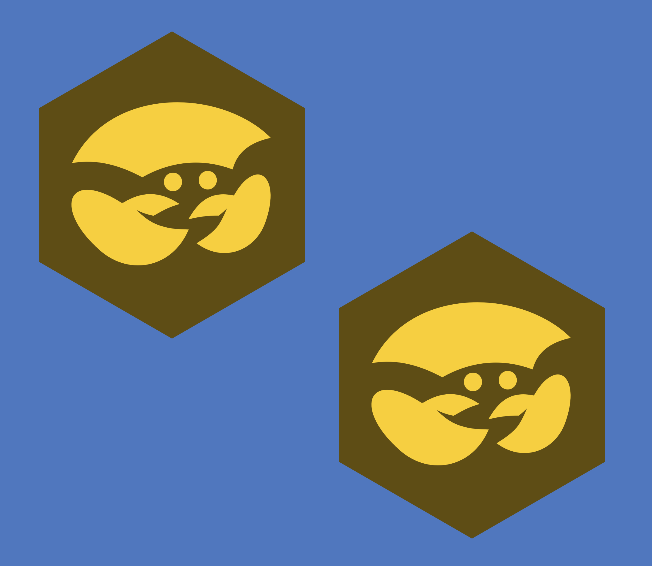
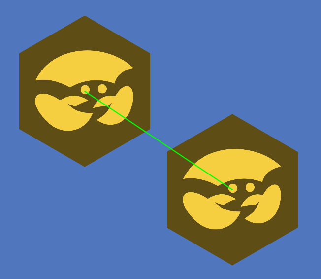
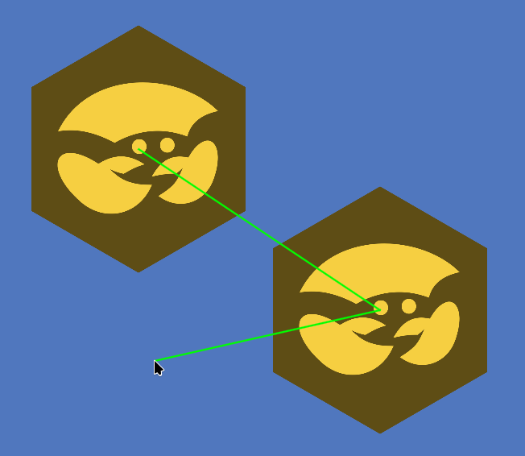
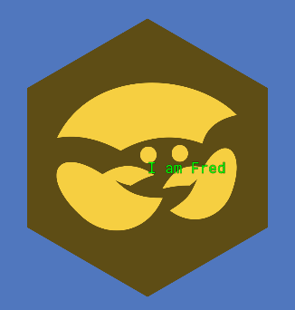
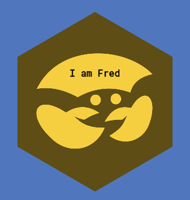
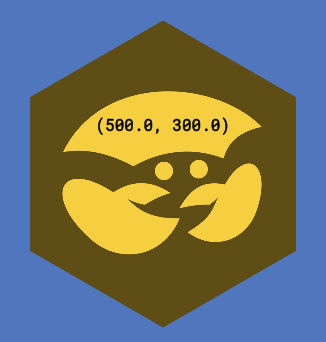
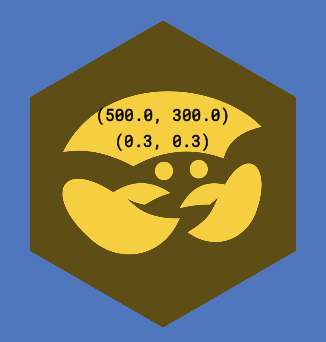

# Debug drawing

Using CrabbyConsole, you can draw all kinds of debug shapes in both 2D and 3D to help diagnose problems in your game.

## 2D

### Lines

To get started, spawn two crabs, Fred and Taco:
```gdscript 
:set fred var spr = Sprite2D.new(); spr.position = v2(500, 300); spr.scale *= 0.3; spr.texture = CrabbyConsole.logo; add_child(spr); spr
```
```gdscript
:set taco var spr = Sprite2D.new(); spr.position = v2(800, 500); spr.scale *= 0.3; spr.texture = CrabbyConsole.logo; add_child(spr); spr
```

Now you should see this:

{: style="width:75%" }

Now, to draw a line between them, you can simply do this:
```
:draw 2d line [fred, taco]
```

And you should see this:

{: style="width:75%" }

The command expects an array of either 2D points, 3D points, or Nodes. You can freely mix them:
```
:draw 2d line [fred, taco, cursor_2d()]
```

Now it will draw two lines: one from Fred to Taco, and another one from Taco to your cursor.

{: style="width:75%" }


### Text

You can also draw text in 2D. This can be useful to draw specific properties of the crabs.

Try this:
```
:draw 2d text [fred, "I am Fred"]
```



That's kind of hard to read, let's fix that by moving the text, changing its color (`-c black`) and alignment (`-a center`):
```
:draw 2d text -c black -a center [fred.position + v2(0, -60), "I am Fred"]
```



So, `:draw 2d text` expects the first element in the array to be a 2D position, 3D position, or a Node. The second element in the array can be anything; it will be automatically converted to a string.

Try this:
```
:draw 2d text -c black -a center [fred.position + v2(0, -60), fred.position]
```

Now you can see Fred's position:



If the second element in the array is itself an array, every element in the array will be drawn on a separate line.

For example, to draw Fred's position and scale:
```
:draw 2d text -c black -a center [fred.position + v2(0, -70), [fred.position, fred.scale]]
```

Now you can see his position and scale:



### Animation

You might've noticed that everything you draw lasts for only one second. You can use `-t` to make the drawn objects stay longer: e.g. `:draw 2d line -t 5` will draw a line that lasts for 5 seconds, or use `-t 0` to make it only last for a single frame.

You also might've noticed that the line/text does not update when the object does. To fix that, you can create a watch that calls `:draw 2d text -t 0` every frame, so the shapes are updated every frame and don't persist to the next frame:
```
:watch add drawer :draw 2d text -t 0 -c black -a center [fred.position + v2(0, -70), [fred.position, fred.scale]]
```

Now the text will update in real time:


## 3D

Good news: the API for 3D drawing is pretty much identical compared to 2D. So all commands above work identically, just replace `:draw 2d line` for `:draw 3d line`.


???+ tip "Protip" 
    If you feed a 3D position into `:draw 2d line` or `:draw 2d text`, it will project the 3D position to 2D using the currently active `Camera3D`. If there is no `Camera3D` in the scene, it will throw an error.
    
    There is no `:draw 3d text` (yet), so you can "fake" drawing text in 3D by passing a 3D position to `:draw 2d text`; it has roughly the same effect[^1].

[^1]: Unless you're making a VR game, then this trick won't work, because 2D nodes are never drawn in VR.