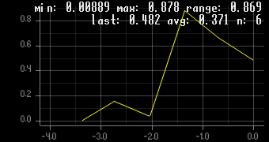
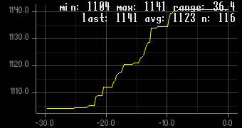
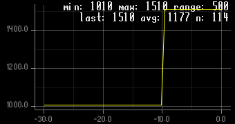
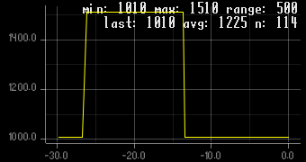
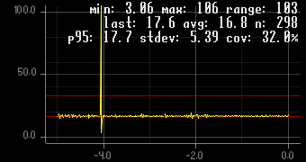
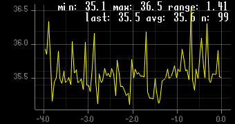
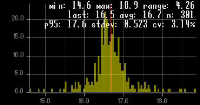
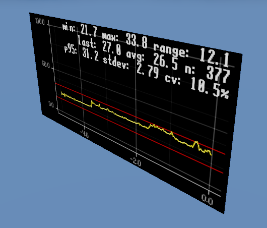

# Plotting expressions

## Line plot

Using the `:plot line` command, you can make line plots out of any expression. 

### Basic example

Let's start with a simple example. Try running this six times:
```linenums="1"
:plot line randf()
:plot line randf()
:plot line randf()
:plot line randf()
:plot line randf()
:plot line randf()
```

!!! tip "Protip"
    You can press ++up++ to access the previous command to quickly run it again.

Every time you run the command, it will sample the expression `randf()` (which generates a random number between 0 and 1) and remember its value. Then, it will draw a plot, using the values from previous calls. The result is a nice little plot like this:

{: style="opacity:0.9" }

Notice how the plot has six data points, since we ran the command six times.

---

We can also run the command automatically by using watches, as seen before:
```
:watch add myplot :plot line randf()
```

Now it will sample the value every frame and update it in real time:

{: style="opacity:0.9" }

### Intermediate example

Here is a more useful example. Try running this:
```
:watch add --rate 4 memory :plot line -t 30 :perf mem
```

???+ question "What does this do?"
    This will create a memory-usage plot that automatically updates itself four times per second.

    Taking apart the individual expressions:

    - `:perf mem` gets the amount of memory currently used by your game, in megabytes.
    - `:plot line -t 30` creates a line plot of the value of `:perf mem`, remembering its previous values for up to 30 seconds.
    - Finally, `:watch add --rate 4 memory` creates a watch called `memory` that calls `:plot line` up to four times per second. (`memory` is an arbitrary name, you can use any name you like.)

    We only update it four times per second, because getting the memory usage can be expensive (especially on Windows).

Now you can see the memory usage of your game over the last 30 seconds:

{: style="opacity:0.9" }

As you can see, the memory usage of our game ranges from 1104 MB to 1141 MB, with an average of 1123 MB.

???+ tip "Protip"
    This works in an exported game as well, unlike [`Performance.get_monitor(Performance.MEMORY_STATIC)`](https://docs.godotengine.org/en/stable/classes/class_performance.html#enum-performance-monitor) and [`OS.get_static_memory_usage()`](https://docs.godotengine.org/en/stable/classes/class_os.html#class-os-method-get-static-memory-usage). Even if you try to use `--remote-debug` to connect to the Godot editor, so you can use its memory usage graph (found in the "Debugger" tab), that unfortunately only works for games exported with `Debug` enabled, not `Release`. So, `:perf mem` is a good way to measure memory usage of an exported game in `Release` mode, which is usually what you want to measure real-world memory usage.


Depending on what you're doing in the game, the memory usage can vary wildly. Let's try creating a large buffer, to see it in action.

Run this to allocate a 500 MB buffer:
```gdscript linenums="1"
:set buffer PackedByteArray()
buffer.resize(500 * 1024 * 1024)
```

Now take a look at the graph...

{: style="opacity:0.9" }

Look! It went up from 1010 MB to 1510 MB, a difference of 500 MB, as expected.

Now deallocate the buffer:
```gdscript
buffer.resize(0)
```

...and the graph drops by 500 MB again:

{: style="opacity:0.9" }


### Advanced examples

#### Frame time plot
Here is a more advanced example:

```
:watch add frametime :plot line -t 5 -y 0..100 -m advanced --threshold 16.666 --threshold 33.333 :perf frame-time --ms
```

The result is a nice little frametime plot:

{: style="opacity:0.9" }

This is useful for profiling your game. If you see any vertical spikes in the graph, that means you have hitches and stutters in your game, which can indicate performance problems.

???+ question "That's a complicated command!"

    Yeah, it kind of is. Read the expression from right to left:
    
    - The expression `:perf frame-time --ms` returns the current frametime in milliseconds (that is, the amount of time elapsed since the last frame).
    - Then, `:plot line` will remember its value over multiple calls and generate a plot. `:plot line` is called with the following arguments:
        - `-t 5` means: remember the values for at most 5 seconds.
        - `-y 0..100` means: set the y-axis of the plot from 0 to 100.
        - `-m advanced` means: draw advanced metrics on the plot (see section [Metrics](#metrics) below).
        - `--threshold` means: draws a red line in the plot, one at `x = 16.666` and another at `x = 33.333`. Those are the frametime targets for 60 FPS and 30 FPS respectively. (This parameter can be specified multiple times.)
    - Finally, `:watch add frametime` ensures `:plot line` is called every frame, so it gathers data every frame, even when the console is hidden. `frametime` is a custom name we can pick ourselves, you can use another name if you'd like.

    The result is a line plot of `:perf frame-time --ms` gathered over the last 5 seconds.

#### Measuring function call time

Using the `:profile` command, you can measure the amount of time it takes to run a command. If you then feed the output of it into `:plot line`, you can repeatedly call the command and sample its running time multiple times. This can be be very useful for commands whose running time is noisy, or if its running time changes depending on external factors.

Try running this:
```
:watch add benchmark :plot line :profile --ms var x = 0; for i in range(1_000_000): x += randf(); x
```

???+ question "What does this do?"
    This will measure how long it takes run the following GDScript code:
    
    ```gdscript
    var x = 0; for i in range(1_000_000): x += randf(); x
    ```

    In other words, it measures how long it takes to generate a million random numbers and sum them together.

    It uses `:profile --ms`, so it will measure the running time in milliseconds instead of seconds.

Now you will see this:

{: style="opacity:0.9" }

As you can see, it takes about **35.6 milliseconds**  on average to execute the full code, with some outliers down to 35.1ms and up to 36.5ms. Looking at the top right, you can see `n: 99`, which means it took 99 samples.

Since we generated a million numbers, dividing the running time by a million gives **35.6 nanoseconds per `randf()` call + addition** on average... which is decently fast.[^2] So we can safely call `randf()` thousands of time per frame without breaking a sweat.

## Histogram

You can also make a histogram, using `:plot histo`. 

Example:
```
:watch add frametime :plot histo -m advanced --threshold 16.666 :perf frame-time --ms
```

This produces a plot like this:

{: style="opacity:0.9" }

This is a different way of visualizing the frametime of your game. Now you can see more clearly how the frametimes are distributed and clustered.

## Metrics

By default, `:plot` draws `basic` metrics on your plot:

- `min`: The smallest value measured so far. 
- `max`: The largest value measured so far.
- `range`: The difference between `max` and `min`.
- `last`: The last value that was measured.
- `avg`: The mean ($\mu$) over all measured values.
- `n`: The amount of measured values.

If you specify `--metrics advanced` or `-m advanced`, it will additionally show these metrics:

- `p95`: The 95^th^ percentile of all measured values.
- `stdev`: The standard deviation ($\sigma$) of all measured values. A higher number means your values are spread further apart.
- `cv`: The [coefficient of variation](https://en.wikipedia.org/wiki/Coefficient_of_variation) of all measured values. This is defined as $CV=\cfrac{\sigma}{\mu}\times100\%$ [^1]. In other words, the standard deviation divided by the mean, expressed as a percentage. This value is useful for determining the stability of your frametimes, while being independent of the current framerate. If $CV\leq5\%$, your frametimes are very stable. Else, you may be experiencing stutters and hiccups.

You can also hide all metrics by using `--metrics none` or `-m none`.
???+ tip "Performance tip"
    Hiding the metrics can increase the performance of the plot generation, since drawing text is currently its main bottleneck.

    Another way to increase the performance is to use the `--rate` parameter. By default, plots are generated up to 15 times per second, but this can be lowered in case you're running into performance issues. Try passing `:plot line --rate 4`, for example, to lower the update rate to 4 times per second.

    Plots are generated on the CPU using the [plotters](https://crates.io/crates/plotters) crate. Ideally, plots would be generated on the GPU to get a massive speed boost, but that is out of scope for the project for now.

## Plots are just textures

Plots are generated by creating an `ImageTexture` and then writing the plot to it. That means you can use them in any context were a regular texture is expected, and they will be updated automatically, even in 3D, and even when the console isn't currently visible.

Here's a fun example of what you can do with this. Try running this:

```linenums="1"
:watch add frametime :set plottex :plot line -t 5 -y 0..100 -m advanced --threshold 16.666 --threshold 33.333 :perf frame-time --ms
var spr = Sprite3D.new(); spr.texture = plottex; add_child(spr)
```

!!! question "How does that work?"
    This is the same example from before that makes a frametime plot, except with `:set plottex` added between `:watch add frametime` and `:plot line`. This will store the plot texture in a variable named `plottex`, so we can use it later and assign it to a new `Sprite3D`.

Now the plot will appear in your 3D world:



This can be very useful to see performance metrics if you're making a VR game, because you don't usually have access to a traditional debug UI.


[^1]: Since we're dividing by the mean ($\mu$), if $\mu=0$ then this will show `?` instead, to avoid dividing by zero.
[^2]: For GDScript standards, at least.

<script
  id="MathJax-script"
  src="https://unpkg.com/mathjax@3.2.2/es5/tex-mml-chtml.js"
  integrity="sha256-MASABpB4tYktI2Oitl4t+78w/lyA+D7b/s9GEP0JOGI="
  crossorigin="anonymous" 
  ></script>
  <!-- To be able to check hash integrity here, we need crossorigin="anonymous" -->
<script>
   // Including raw js here so it's only on this page, not on all pages.
   // Also, I pinned it to version 3.2.2 instead of just "3" so it doesn't silently upgrade.    
  window.MathJax = {
    tex: {
      inlineMath: [["\\(", "\\)"]],
      displayMath: [["\\[", "\\]"]],
      processEscapes: true,
      processEnvironments: true
    },
    options: {
      ignoreHtmlClass: ".*|",
      processHtmlClass: "arithmatex"
    }
  };

  document$.subscribe(() => {
    MathJax.startup.output.clearCache()
    MathJax.typesetClear()
    MathJax.texReset()
    MathJax.typesetPromise()
  })
</script>