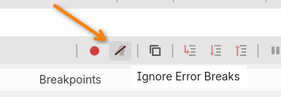

# FAQ

## How to disable the console in the final build of my game?

Disable the CrabbyConsole plugin in your project settings, and it should remove the `CrabbyConsole` autoload from your project. If not, you can just remove it manually.

## The Godot editor pauses my game every time I run a command in the console. What to do?

Press the "Ignore Error Breaks" button to stop the editor from interrupting your game...



...then press ++f7++ in the editor to continue the game.

Alternatively, run your game from Godot's project manager. You can open it by pressing ++ctrl+shift+q++ in the editor.

??? question "Why is this needed?"
    The console's expression evaluator will first try to convert whatever you typed into a script like this:
    ```gdscript
    func run():
        return <EXPR>
    ```
    ...where `<EXPR>` is the thing you typed into the console. If that fails to parse, it will try it again like this:
    ```gdscript
    func run():
        <EXPR>
    ```

    That way, GDScript statements and expressions can be used interchangeably, without you having to worry about which one is which. Otherwise, you wouldn't be able to type stuff like `1+2` or `foo` in the console; you would have to type `return 1+2` and `return foo` instead.

    The flip side of this is: in the case the first parse fails but the second parse succeeds, Godot will think a script error occurred, and interrupt your game.

    This can happen if you run a command like `print("hi")`, which gets turned into...

    ```gdscript
    func run():
        return print("hi")
    ```

    ...which is syntactically valid, but *not* semantically valid[^2]. So, Godot will raise an error:

    ```
    Cannot get return value of call to "print()" because it returns "void".
    ```

    It is also possible to produce syntactically invalid GDScript this way, for instance, by running `Engine.max_fps = 30`, which turns into:

    ```gdscript
    func run():
        return Engine.max_fps = 30
    ```
    ...which does not even parse: 

    ```
    Assignment is not allowed inside an expression.
    ```

    So, that explains why Godot interrupts your game, even when you run a seemingly valid expression.

    ----

    Using the [`Expression`](https://docs.godotengine.org/en/stable/classes/class_expression.html) class to evaluate GDScript is not an adequate solution, because it does not support frequently used operations such as:

    - variable assignment (`var x = 1`)
    - closures (`func(x): return x + 1`)
    - the ternary operator (`1 if true else 0`)
    - the `$` syntax (`$MyNode.hide()`)
    - the `%` syntax (`%MyUniqueNode.hide()`)

## When I run `CrabbyConsole.add_custom_command("sum", func(a, b): return a + b)` in the console itself, and then try to call `:sum`, it says: `Error: Callable is not valid - did it get freed?`

This is related to the previous issue, because it has to do with the way CrabbyConsole's GDScript expression evaluator works.

The expression you write gets stored in a temporary script, which includes the closure `func(a, b): return a + b`. The moment you call `add_custom_command()`, the closure gets passed to CrabbyConsole in the form of a `Callable`. However, as soon as you run another GDScript command, the previous script gets destroyed, including its closure. That means `:sum`'s `Callable` now points to a destroyed closure, so you can no longer call it.

Fixing this would require the expression evaluator to not only store previous scripts, but also the script instances themselves, because that is where the actual closure is stored. This is currently not supported, because it will take a lot of effort, but it may be in the future[^1].

## When I use `CrabbyConsole.eval_blocking()` in the console I get this error: `Method/function failed. Returning: ERR_ALREADY_IN_USE (Cannot reload script while instances exist.)`

This happens because only one GDScript expression can be evaluated simultaneously. To fix it, use `call_deferred()` instead:
```gdscript
CrabbyConsole.eval_blocking.call_deferred("print(1+2)")
```
Note: using `call_deferred()` means you cannot return values anymore, so be sure to `print()` them instead. 

!!! question "Why would you do this instead of just `print(1+2)`?"
    This enables you do procedural code generation, which can be super powerful; it becomes kind of like a macro system.

    Try running this, for example:
    ```gdscript
    :for i 1 5 CrabbyConsole.eval_blocking.call_deferred(":set number{i} {i}*2")
    ```

    This will define 5 variables, run `:vars` to see them:
    ```gdscript
    [[&"number1", 2], [&"number2", 4], [&"number3", 6], [&"number4", 8], [&"number5", 10]]
    ```

    Now you can generate code at runtime!

[^1]: Unless it causes memory leaks, in that case it may never be implemented - that would be especially problematic in situations where many expressions are evaluated every frame.
[^2]: This seems kind of inconsistent, because if you define a function `func foo(): print("hi")` and then do `return foo()`, that *is* actually semantically valid. Why the inconsistency, Godot?