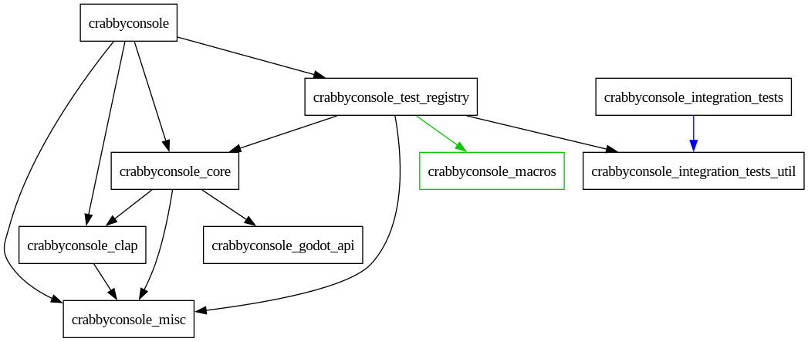

# Development
## Compiling

CrabbyConsole is written in Rust. To compile it:

0. [Install the Rust toolchain](https://rust-lang.org/tools/install/) if you don't have it yet.
1. Go to the `rust` folder in the repo.
2. Run `cargo build --lib --profile release`[^1]. This will produce a file called `libcrabbyconsole.so` or `crabbyconsole.dll` in `rust/target/release/`, depending on your OS.
3.  Copy (or symlink) it to the `addons/crabbyconsole/bin/` folder.
4. Now you can open the Godot project, found in the `godot` folder, and it should load the GDExtension you just compiled.

[^1]: You can also run `cargo build --lib --profile release-with-debug` instead to get debug information - useful for getting better stacktraces and profiling. In that case, you can find the library file in `rust/target/release-with-debug/`.

## Testing

To run unit and integration tests:

1. [Install Just](https://github.com/casey/just) (version 1.32.0+) if you don't have it yet.
1. [Install Nextest](https://nexte.st/) if you don't have it yet.
1. Ensure `godot` is in your `PATH`. This is needed, because the integration tests need to start Godot as part of the testing process. If you have multiple versions of Godot installed, you can set an environment variable `GODOT4_BIN` to point it to the correct version of Godot.
1. Go to the root folder of the repo.
1. Ensure you compiled CrabbyConsole first and copied/symlinked the library file, see section [Compiling](#compiling).
1. Also ensure you've opened the project in Godot at least once. If not, you can run `just import-project` to automate this step.
1. Run `just test-release`. (or `GODOT4_BIN=/path/to/your/godot just test-release` if you specify a custom Godot version)

!!! warning "Warning"
    For reasons unbeknownst to man, compiling the tests on Linux can be extremely slow. To mitigate this, [install the `mold` linker](https://github.com/rui314/mold) and run the tests using it like this:
    ```bash
    mold -run just test-release
    ```

    In my experiments this can be up to **10x** faster!

### How the tests work
The testing suite of CrabbyConsole is... interesting, to say the least. Every integration test actually spins up a [headless instance of Godot](https://docs.godotengine.org/en/stable/tutorials/export/exporting_for_dedicated_servers.html#exporting-for-dedicated-servers). Then, it will tell Godot which test to run using the `--crabbyconsole-test` CLI flag. To make this work, tests need to be split off into their own crates, which explains the peculiar dependency graph:



This approach has the following upsides:

- Tests can be written in Rust and actually run inside of Godot, providing wider test coverage.
- Tests can be run across many Godot versions automatically.
- Tests can be run both in the editor build and the exported game.
- Additionally, thanks to [Nextest's execution model](https://nexte.st/docs/design/why-process-per-test/), every integration test runs it in own isolated process, so if one test crashes, it doesn't take down the others with it.

But there are some downsides as well:

- Testing code ends up in the final build, slowing down compile times and increasing binary size.


## Tracy

Compile with `--features tracy` feature to use Tracy.

How to set it up:

- Set `RUST_LOG` env var to `trace`, otherwise it won't capture all spans/messages.
- There seems to be a bug in the Tracy app where the `Messages` window occasionally goes missing. Delete the `~/.config/tracy` folder to fix it.
- It should now just work. On Linux, follow these steps get more detailed information:
    - Run this first:
    ```bash
    echo '-1' | sudo tee /proc/sys/kernel/perf_event_paranoid
    ```
    : This has a noticeable effect: you can now see kernel events in the profiler (shown in red). 
    - Then, run Godot as root: `sudo RUST_LOG=trace godot`
    : This will give much more detailed info. It also includes info about other processes, context switching between cores, things waiting for other things, etc. 

